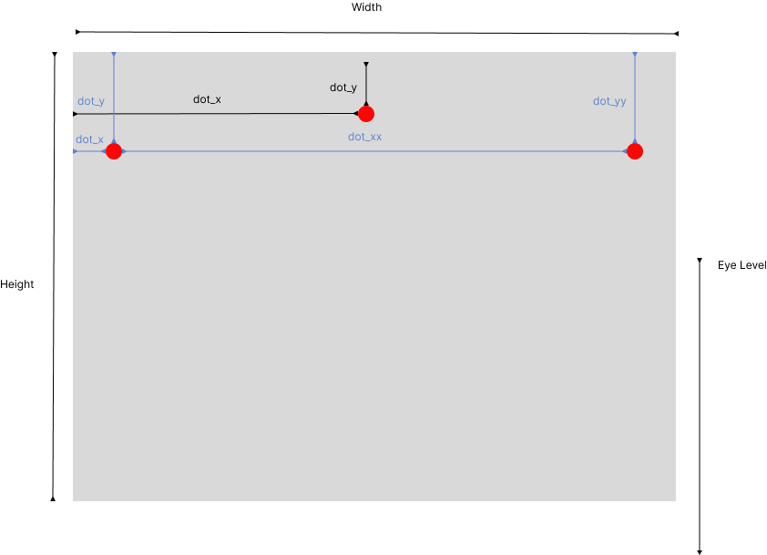

<h1>Story Behind</h1>
During the installation of artworks, I found it is handicap to measure, draw and calculate the math on-site (specially there is usually no table) That is why I created this tools for artwork handler (Setup 9) to do the calculation smoother.

<h1>About</h1>
A tool calculate the math for artwork installation. 
Input the frame information and give you where the screw will be on a simple image.
There are two mode for different hanging system, single anchor mode for wire and sawtooth hanger.
double anchor mode for hanging hooks
 
User can reference the image below for usage

 