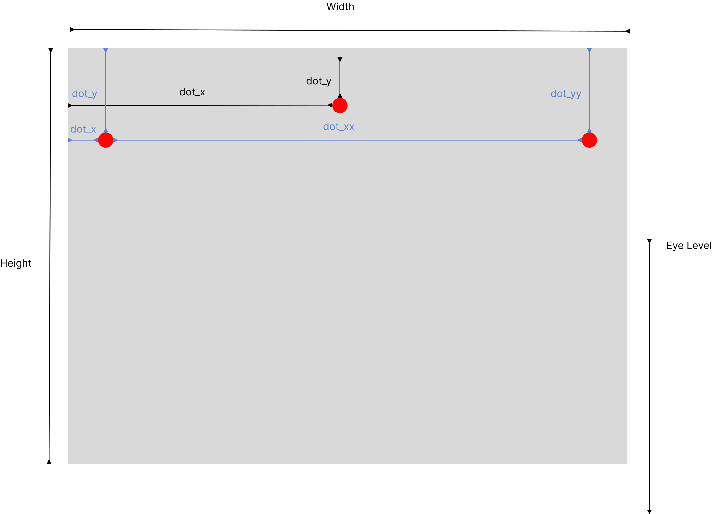

<h1>Story Behind</h1>
During the installation of artworks, I found it is handicap to measure, draw and calculate the math on-site (specially there is usually no table) That is why I created this tools for artwork handler (Setup 9) to do the calculation smoother.

<h1>About</h1>
A tool calculate the math for artwork installation. 
Input the frame information and give you where the screw will be on a simple image.
There are two mode for different hanging system, single anchor mode for wire and sawtooth hanger.
double anchor mode for hanging hooks
 
User can reference the image below for usage

<h1>Requirements</h1>
For requirement details please read requirements.txt, the tool used python with flask framework, html and matplotlib as image output. Gunicorn is used for running in production environment.
The project is aim to be a light weight docker image which will be deploy to Google Cloud Run

<h1>Change Log</h1>
2024-02-08 added title input and display as title in the output image. For user to save the image before work and able to know which image is which work.

<h1>To Do</h1>
- Multi work installation to display more than one framed artwork and know the distance/ hight between them. 
 
- Add save and print button, for user easy download/print the image as a construction preview.

 